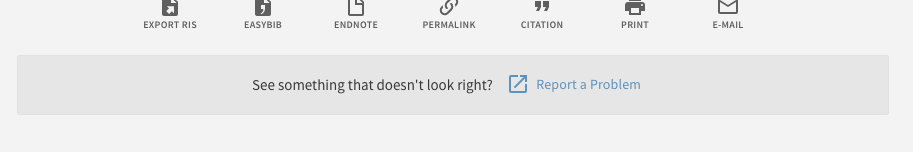

# primo-explore-report-problem

[](https://www.npmjs.com/package/primo-explore-report-problem)

## Features
A banner with a link to report a problem/bug appears below the "send to" actions in the details view. The text of the banner is configurable, and clicking the button will redirect to an external URL and pass the parameters of the current search to that URL. This can be used to auto-fill an external "report problem" form.

### Screenshot


## Install
1. Make sure you've installed and configured [primo-explore-devenv](https://github.com/ExLibrisGroup/primo-explore-devenv).
2. Navigate to your template/central package root directory. For example:
    ```
    cd primo-explore/custom/MY_VIEW_ID
    ```
3. If you do not already have a `package.json` file in this directory, create one:
    ```
    npm init -y
    ```
4. Install this package:
    ```
    npm install primo-explore-report-problem
    ```

alternatively, just copy `dist/module.js` into your package's `custom.js` file.

## Usage
Once this package is installed, add `reportProblem` as a dependency for your custom module definition.

```js
var app = angular.module('viewCustom', ['reportProblem'])
```

Then, enable the customization by embedding it in the `prmActionListAfter` hook:
```js
app.component('prmActionListAfter', {template: '<oca-report-problem />'})
```

#### Configuration
You can configure the banner by passing in attributes to the `oca-report-problem` element. The `report-url` property is required; the others will default to the values shown in the screenshot.

| name      | type         | usage                                                                                   |
|-----------|--------------|-----------------------------------------------------------------------------------------|
| `message-text` | string       | banner text displayed next to the button.                                               |
| `button-text`  | string       | text displayed on the button itself.                                                    |
| `report-url`    | string (url) | base URL for your 'report a problem' page, to which all of the search parameters will be sent |

The line below would add a banner with different button and message texts.

```js
app.component('prmActionListAfter', {template: '<oca-report-problem report-url="http://my.library.edu/reportproblem.php?" message-text="Want to report a problem?" button-text="Submit report" />'})
```

When the button is clicked, if the user was viewing a page like: `https://primo.lclark.edu/primo-explore/fulldisplay?docid=CP71139633100001451&context=L&vid=......`

They would be sent to:
`http://my.library.edu/reportproblem.php?docid=CP71139633100001451&context=L&vid=.....`

All of the URL parameters could then be handled by a server-side script.

## Running tests
1. Clone the repo
2. Run `npm install`
3. Run `npm test`
